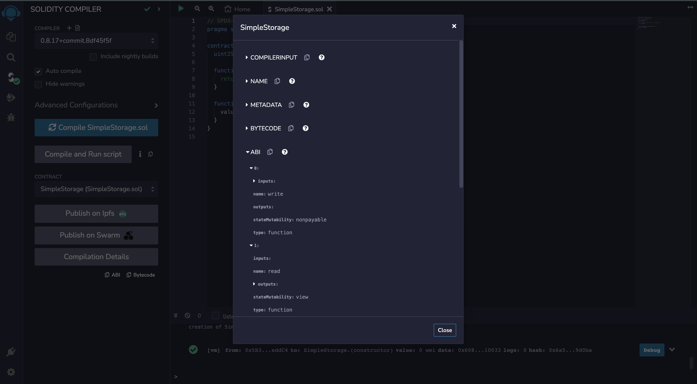

# Solidity dApps with React and Truffle Box
Chapter 3: Step-by-step building web3 smart contract with react truffle box, solidity, and ABI (Application Binary Interface)

Decentralized applications (dApps) have become increasingly popular in recent years due to the transparency, security, and immutability provided by blockchain technology. Developing dApps requires knowledge of blockchain programming languages such as Solidity, as well as web development technologies such as React. 

Truffle Box is a popular tool that provides developers with pre-built project templates for building dApps. By combining Solidity, React, and Truffle Box, developers can create powerful and secure dApps that leverage the benefits of blockchain technology. 

In this chapter, we will explore the process of building dApps using Solidity, React, and Truffle Box. We will cover the essential concepts and tools needed to build decentralized applications, including the basics of Solidity, the React framework, and Truffle Box project templates. We will also demonstrate how to integrate these technologies to create a full-stack dApp, highlighting best practices and common pitfalls along the way.

## The Chapters
- Chapter 1: [Solidity Remix Basic Syntax](https://github.com/kecci/solidity-remix-basic)
- Chapter 2: [Simulation VM with Ganache and MetaMask for Solidity Smart Contract](https://github.com/kecci/solidity-truffle-ganache-remix)
- Chapter 3: [Building Simple Decentralized Application with React and Truffle Box](https://github.com/kecci/solidity-react-truffle-box) (you in here)

## Table of Contents
- [Solidity dApps with React and Truffle Box](#solidity-dapps-with-react-and-truffle-box)
  - [The Chapters](#the-chapters)
  - [Table of Contents](#table-of-contents)
  - [ABI (Application Binary Interface)](#abi-application-binary-interface)
    - [Connecting Smart Contract to Website](#connecting-smart-contract-to-website)
    - [How ABI works ?](#how-abi-works-)
    - [ABI vs API](#abi-vs-api)
    - [Compilations Detail](#compilations-detail)
  - [React Truffle Box](#react-truffle-box)
    - [Installation](#installation)
    - [FAQ](#faq)
  - [Setup Ganache with Truffle Box](#setup-ganache-with-truffle-box)
    - [I. Ganache workspace](#i-ganache-workspace)
    - [II. Truffle Compile](#ii-truffle-compile)
    - [III. Truffle Test](#iii-truffle-test)
    - [IV. Ganache Contract](#iv-ganache-contract)
    - [V. Truffle Migrate](#v-truffle-migrate)
  - [Run Client (React Truffle Box)](#run-client-react-truffle-box)
    - [Run NPX](#run-npx)
    - [Connect to Metamask](#connect-to-metamask)
  - [Source](#source)

## ABI (Application Binary Interface)


Application Binary Interface (ABI) is a standardized interface for communication between different software modules, often between a high-level language and a low-level language or hardware. In the context of blockchain technology, an ABI specifies the rules for encoding and decoding messages that are sent between smart contracts on the blockchain network.

An ABI is critical for enabling communication between smart contracts written in different programming languages, allowing them to interact with each other seamlessly. ABI defines the structure of the data that is passed between the contracts and the types of functions that can be called. It provides a clear and well-defined interface that ensures that the contracts interact with each other in a standardized and secure manner.

ABI plays an essential role in the development of decentralized applications (dApps) that run on blockchain networks. It provides developers with a standardized way of communicating with smart contracts, making it easier to create complex applications that interact with multiple smart contracts. Moreover, ABI enables the creation of libraries and modules that can be reused across different smart contracts, reducing development time and costs.

[Application Binary Interface](https://www.youtube.com/watch?v=fP5lu_E7AY0&list=PLH1gH0TmFBBhvZi4kEqU6kCjyv_y8qBae&index=35)

### Connecting Smart Contract to Website
1. Install Web3Js
2. **ABI & Bytecode**
3. Address Smart Contract

### How ABI works ?
- Smart contract needs to compile in bytecode at EVM (Ethereum Virtual Machine)
- Smart contract deployed will generate bytecode are saved in blockchain in an address.
- In EVM and Ethereum, Smart contract only bytecode orders
- All functions that defined in smart contract, user need to translate names and arguments in bytecode representation.
- To be interpreted, byte that sent by user need to re-convert in tuple (dictionary).
- All format above are ABI.


### ABI vs API
- ABI looks like API
- ABI defines method and structure that used to interact with binary contract.
- ABI handled by compiler, like a Remix.
- ABI are in the form of a JSON.


### Compilations Detail



## React Truffle Box
This box comes with everything you need to start using Truffle to write, compile, test, and deploy smart contracts, and interact with them from a React app.

### Installation

First ensure you are in an empty directory.

Run the `unbox` command using 1 of 2 ways.

```sh
# Install Truffle globally and run `truffle unbox`
$ npm install -g truffle
$ truffle unbox react
```

```sh
# Alternatively, run `truffle unbox` via npx
$ npx truffle unbox react
```

Start the react dev server.

```sh
$ cd client
$ npm start
```

From there, follow the instructions on the hosted React app. It will walk you through using Truffle and Ganache to deploy the `SimpleStorage` contract, making calls to it, and sending transactions to change the contract's state.

### FAQ

- __How do I use this with Ganache (or any other network)?__

  The Truffle project is set to deploy to Ganache by default. If you'd like to change this, it's as easy as modifying the Truffle config file! Check out [our documentation on adding network configurations](https://trufflesuite.com/docs/truffle/reference/configuration/#networks). From there, you can run `truffle migrate` pointed to another network, restart the React dev server, and see the change take place.

- __Where can I find more resources?__

  This Box is a sweet combo of [Truffle](https://trufflesuite.com) and [Webpack](https://webpack.js.org). Either one would be a great place to start!

## Setup Ganache with Truffle Box

### I. Ganache workspace
[TBD](https://www.youtube.com/watch?v=Qy_95FYLM_k&list=PLH1gH0TmFBBhvZi4kEqU6kCjyv_y8qBae&index=36)

### II. Truffle Compile
TBD

### III. Truffle Test
TBD

### IV. Ganache Contract
TBD

### V. Truffle Migrate
TBD

## Run Client (React Truffle Box)

### Run NPX
TBD

### Connect to Metamask
TBD

## Source
- Ipung Dev:
  - ABI: https://www.youtube.com/watch?v=fP5lu_E7AY0&list=PLH1gH0TmFBBhvZi4kEqU6kCjyv_y8qBae&index=35
  - React Truffle Box Installation: https://www.youtube.com/watch?v=Qy_95FYLM_k&list=PLH1gH0TmFBBhvZi4kEqU6kCjyv_y8qBae&index=36
- Facundo Carballo
  - ToDo Task: https://www.youtube.com/watch?v=cyKvTo89HRY
- Budi Winarno
  - Simple Dapp: https://www.youtube.com/watch?v=yHdoHqqo3JA
- Code Coliseum
  - Basic App: https://www.youtube.com/watch?v=AKXFziwYUWE
- Web Dev Cody
  - Buy Ticket Simulation: https://www.youtube.com/watch?v=JXa_Y-17Oj4
- One More Journey
  - Pete's Pet Shop: https://www.youtube.com/watch?v=kkiaBPcnc6U&list=PLde8eDss7CuQLM46HkFKnTyTNoKccQanI
